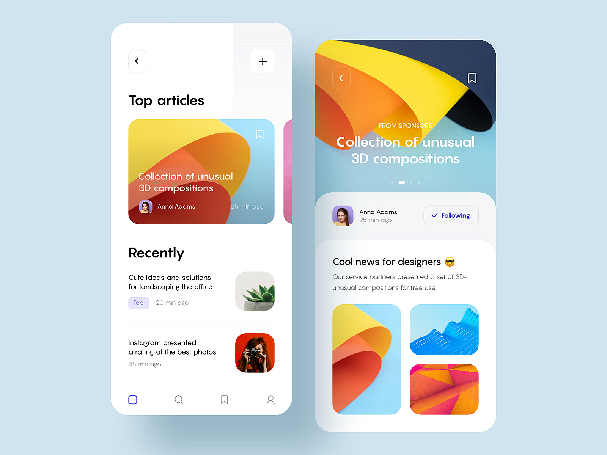
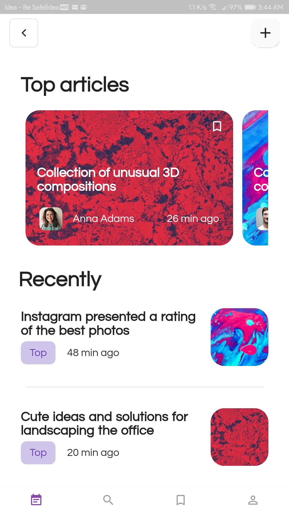
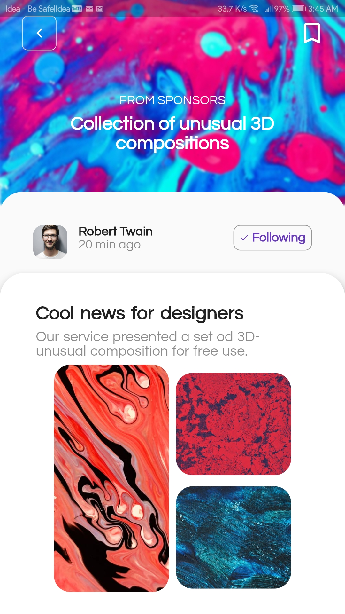
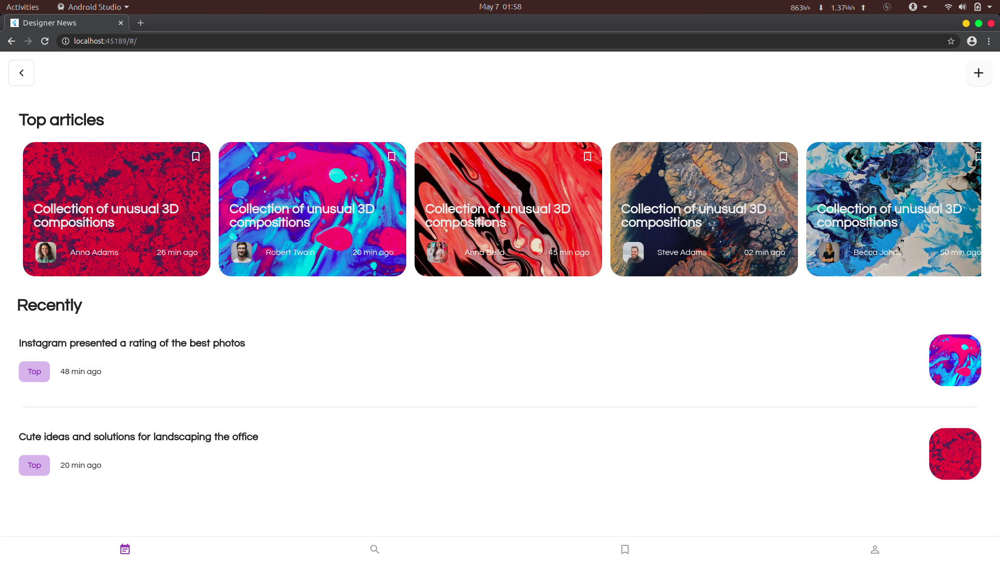
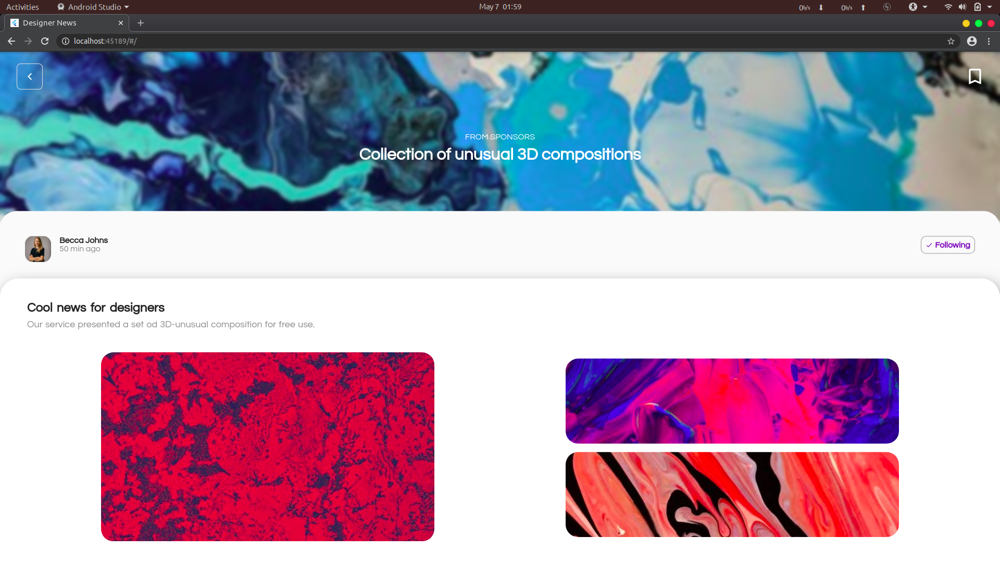
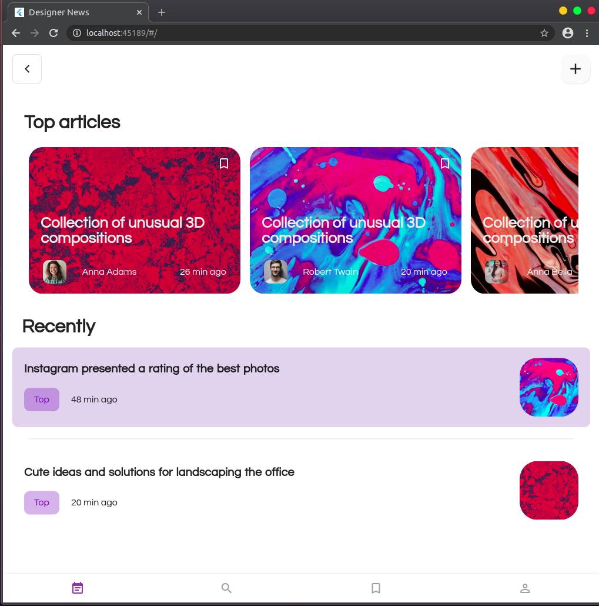
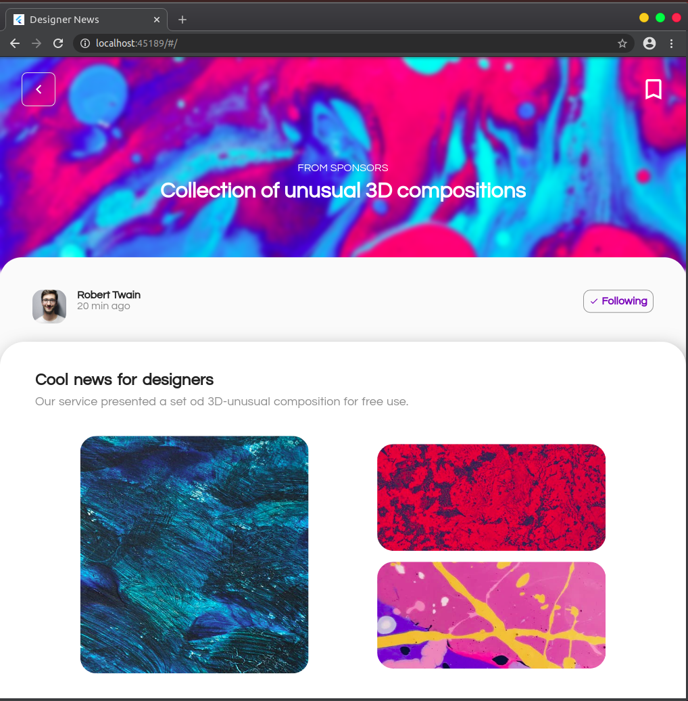

# Designer News
A responsive Flutter App.

A Designer News App, made with keeping Mobile and Web in mind.

## Getting Started

This project is a starting point for a Flutter application.

A few resources to get you started if this is your first Flutter project:

- [Lab: Write your first Flutter app](https://flutter.dev/docs/get-started/codelab)
- [Cookbook: Useful Flutter samples](https://flutter.dev/docs/cookbook)

For help getting started with Flutter, view our
[online documentation](https://flutter.dev/docs), which offers tutorials,
samples, guidance on mobile development, and a full API reference.

## Screenshots

### Mockup
<table>
  <th> 
    UI Mockup by 
    <a href = "https://dribbble.com/shots/7032030-News-app-design/attachments/32143?mode=media">
      Rocket Science
    </a> 
  </th>
  
  <tr>
  <td>
  </td>
  </tr>
</table>


### Mobile UI
<table>
  <tr>
  <td>Article Screen </td>
   <td>GIF </td>
  <td>Detailed Screen </td>
  </tr>
  
  <tr>
  <td></td>
  <td></td>
  <td></td>
   </tr>
    
  </table>
  
  ### Web UI
  
 <table>
  <th colspan=2> Full Expanded </th>
  <tr>
    <td>
      
    </td>
    <td>
      
    </td>
  </tr>
 </table>
 
  <table>
  <th colspan=2> Half Expanded </th>
  <tr>
    <td>
      
    </td>
    <td>
      
    </td>
  </tr>
 </table>
 
 ### Sample Code
 
 #### main.dart
 
 ```main.dart
 import 'package:designernewsapp/views/main_page.dart';
import 'package:flutter/material.dart';
import 'package:google_fonts/google_fonts.dart';

void main() => runApp(
MaterialApp(
  debugShowCheckedModeBanner: false,
  title: 'Designer News',
  theme: ThemeData(
    visualDensity: VisualDensity.adaptivePlatformDensity,
    primaryColor: Colors.purple[800],
    accentColor: Colors.purple[800].withOpacity(0.8),
    textTheme: GoogleFonts.questrialTextTheme()
  ),
  home: MyNewsApp(),
)
);


class MyNewsApp extends StatelessWidget {
  @override
  Widget build(BuildContext context) {
    return Scaffold(
      backgroundColor: Colors.white,
      bottomNavigationBar: BottomAppBar(
        elevation: 5,
        child: Row(
          mainAxisAlignment: MainAxisAlignment.spaceAround,
          children: <Widget>[
            IconButton(icon: Icon(
              Icons.event_note,
              color: Theme.of(context).accentColor,
            ), onPressed: (){}),

            IconButton(icon: Icon(
                Icons.search
            ), onPressed: null),

            IconButton(icon: Icon(
                Icons.bookmark_border
            ), onPressed: null),

            IconButton(icon: Icon(
                Icons.person_outline
            ), onPressed: null)
          ],
        ),
      ),
      body: Padding(
          padding: EdgeInsets.symmetric(horizontal: 16, vertical: 8),
        child: SafeArea(
          child: SingleChildScrollView(
              child: MainPage()
          ),
        ),
      ),

    );
  }
}
```

## If you like my work and want to show some ❤️, please consider giving a ⭐️ to this Repository.
